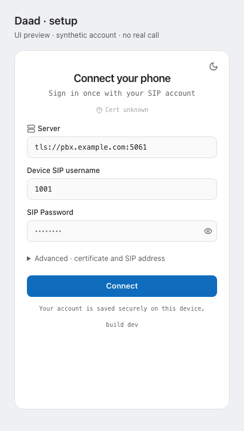
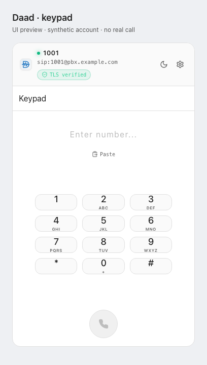

# Daad · داد

A small open-source native softphone: **one account, one call, a simple keypad.**
Built with Tauri, React, and PJSIP. GPL-3.0-or-later.

[Downloads](https://github.com/A-K-6/Daad/releases) · [Platform builds](docs/PLATFORMS.md) · [Report a bug](https://github.com/A-K-6/Daad/issues/new/choose) · [Contribute](docs/CONTRIBUTING.md)



*UI preview using real components with synthetic data. This is not a recording of registration or a live call.*

## What works—and what needs testers

The desktop engine uses PJSIP 2.17 for SIP/TLS, mandatory SDES-SRTP, PCMU/PCMA audio, and RFC 4733 keypad tones. Account credentials are saved in the OS credential store. The UI provides answer/reject, mute, hold, hangup, recent calls, and light/dark themes. Choose microphone and speaker through system sound settings.

Incoming ringing/audio and outbound two-way calls have been confirmed with Asterisk in development builds. Disposable Asterisk tests cover encrypted echo audio, keypad delivery, credential/certificate rejection, and cleanup. Fresh-install microphone permissions, packaged hold/resume, network recovery, and long-call stability need more testing. See [verification notes](docs/NATIVE_ALPHA.md).

**This is an unsigned, experimental alpha, not a stable release.** The existing published release is for macOS Apple Silicon. The platform build pipeline now covers Intel Mac, Windows x64/ARM64, Linux x64/ARM64, Android and iOS. See [platform status and build instructions](docs/PLATFORMS.md); CI artifacts are not proof of device acceptance. The website previews the interface; native calling requires the desktop app.

## Install

1. Download the ARM64 DMG and `SHA256SUMS.txt` from the same release. Compare the DMG's `shasum -a 256` output with the checksum file.
2. Open the DMG and drag Daad into Applications. Fully quit any older Daad process first—closing its window can leave it running in the tray.
3. Open Daad. It is not Developer ID signed or notarized; macOS may block first launch. After verifying the download, use **System Settings → Privacy & Security → Open Anyway** if offered.
4. Allow microphone access when prompted. Enter your own SIP account as described below.

## Connect your PBX

You need a SIP account on a PBX supporting TLS and SDES-SRTP, with G.711 enabled. Enter a server such as `tls://pbx.example.com:5061`, your SIP username, and password. Daad derives the SIP address; Advanced settings allow an explicit address, extension, and CA import.

Public builds do not contain organization-specific CA certificates or private host presets. For a private PBX, obtain its public CA certificate from its administrator through a trusted channel and import it in Advanced settings. Daad verifies certificates and does not automatically trust a certificate received from an unverified server. Account-specific CA settings are stored with the account. The app does not change PBX configuration.

If registration fails, check your network/VPN, server name, port, credentials, and certificate. If registration succeeds but calls fail, check the PBX dial plan, codec/encryption settings, and RTP routing. Share only sanitized diagnostics when reporting an issue.

## Help shape the alpha

Try it with your own test PBX and tell us what breaks. [Open a bug or feature request](https://github.com/A-K-6/Daad/issues/new/choose), or pick a small task from [the contributor backlog](docs/COMMUNITY.md#contributor-backlog). Include versions and reproducible steps; never post passwords, real phone numbers, private addresses, or raw SIP captures.



## Build and test

Install Xcode command-line tools, Rust, and Bun on macOS, then:

```sh
brew install openssl@3 pkg-config
bun install --frozen-lockfile
bun run native:prepare
bun run tauri dev
```

```sh
bun run typecheck
bun run lint
bun run test
cargo test --locked --manifest-path src-tauri/Cargo.toml
bun run tauri build
```

With Docker and native dependencies ready, `bun run test:native` starts a disposable local Asterisk with synthetic credentials and generated audio. It never targets your live PBX. Physical microphone/speaker testing remains separate. See [the contributor guide](docs/CONTRIBUTING.md).

## Architecture and license

React → SipContext → NativeSipClient → Tauri commands → Rust adapter → PJSIP.
PJSIP owns SIP transactions, registration refresh, codecs, native audio, and RTP/SRTP. The old custom desktop SIP/media stack was removed. Legacy browser/SDK code is separate from this native path.

[GPL-3.0-or-later](LICENSE). Release assets include corresponding source and dependency notices; see [third-party notices](THIRD_PARTY_NOTICES.md). Older releases and Git history retain their original contents, including the former deployment-specific public CA; removing it from current builds does not rewrite history.
